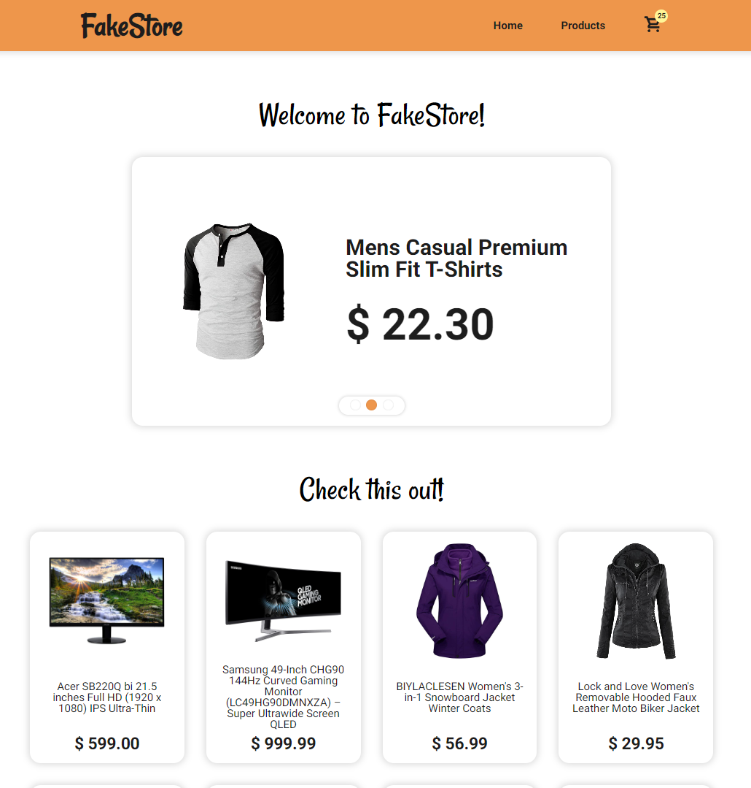

# FakeStore

Este é um projeto de loja online feito com React. O projeto foi proposto pelo site [The Odin Project](https://www.theodinproject.com) para aprendizado de React Router Dom e requisição de dados.

## Funcionalidades

- Roteamento feito no lado do cliente, trazendo uma mudança de páginas instantânea.
- Carrinho de compras ajustável e salvo no Local Storage do navegador.
- Visual leve, simples e fácil de usar (feito com Styled-Components).
- Os dados vêm da [Fake Store API](https://fakestoreapi.com). Estão em inglês, por isso resolvi desenvolver o site no idioma.

## Instalação

- Faça um fork do repositório para a sua conta do GitHub;
- Clone o repositório para o seu computador usando `git clone`;
- Abra o terminal e `cd` até o diretório do repositório;
- `npm install` para instalar as dependências do projeto;
- `npm run dev` para iniciar o ambiente de desenvolvimento.
